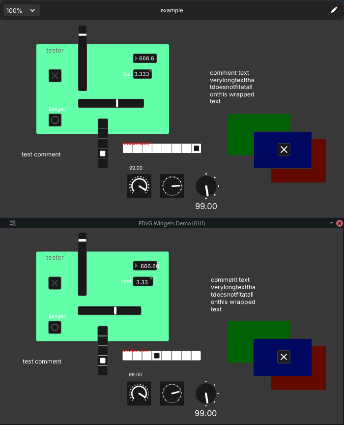

# Example plugin for PDVG

This example plugin showcases how [PDVG](https://github.com/Wasted-Audio/PDVG) implements various plugdata UI objects in order to match with very similar output drawing style and user interaction.

The plugin itself does not do any DSP processing and is only used to build the GUI. All widgets are placed and configured by hand, based on the `example.pd` patch file coordinates and configuration.

## Example build

Here we see a comparison of the graphics between plugdata (top) and the PDVG based DPF build (bottom):

